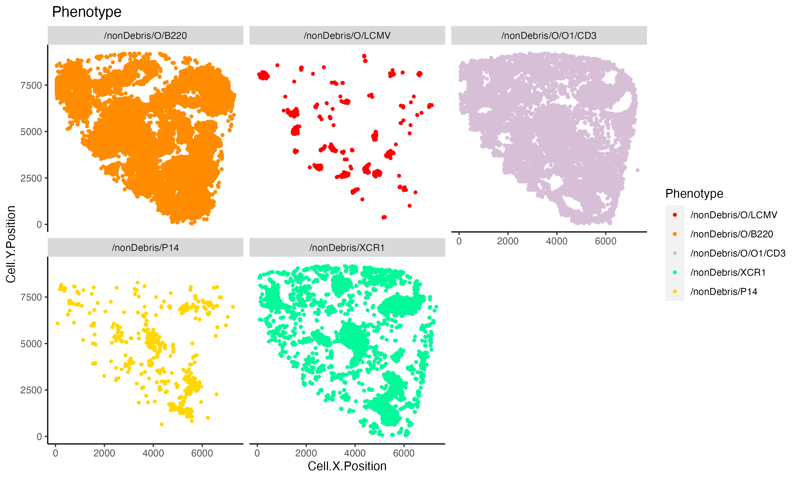

.. _access_data_rmarkdown:

Access data in RMarkdown
=========================

The data generated in `Cecelia` can be further analysed in R-Markdown for custom quantification or visualisation. The main principle is that the generated `populations` can be loaded as `data-table` which can be used for various functions. Here we make use of the results generated in :ref:`tutorial_live`.

Live cell imaging
------------

We need to activate the `renv` environment to use all packages. `Sys.setenv(KMP_DUPLICATE_LIB_OK = "TRUE")` must be added before loading anything as R can otherwise crash. See `Github issue <https://github.com/dmlc/xgboost/issues/1715#issuecomment-438924721>`_ for details if required.

.. code-block:: r
  :linenos:
  
  Sys.setenv(KMP_DUPLICATE_LIB_OK = "TRUE")
  library(cecelia)
  cciaUse("~/cecelia/dev")
  
  # for plotting and general data processing
  library(ggplot2) 
  library(tidyverse)
  
  
  # init ccia object
  cciaObj <- initCciaObject(
    pID = pID, uID = "6QzZsl", versionID = versionID, initReactivity = FALSE
  )
  
  uIDs <- names(cciaObj$cciaObjects())
  
  # get pops
  pops <- cciaObj$popPaths(popType = "flow", includeFiltered = FALSE, uIDs = uIDs[1])
  
  # exclude 'O' pops
  pops <- pops[is.na(str_match(pops, "/O[0-9]*$"))]
  pops <- pops[is.na(str_match(pops, "/nonDebris$"))]
  
  spe <- cciaObj$spe(popType = "flow", pops = pops, uIDs = uIDs)
  

    

   